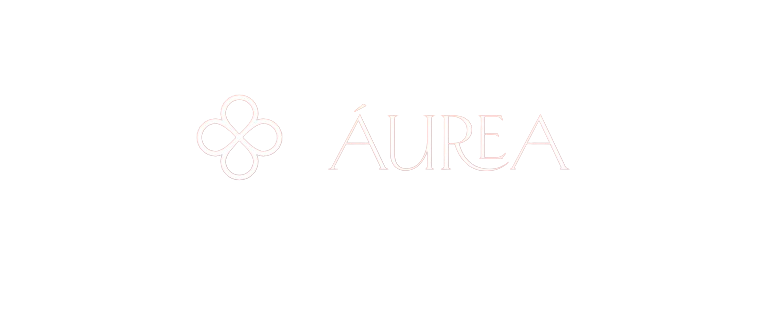

Ecommerce exclusivo de semijoias 

  <a href="#-tecnologias">Tecnologias</a>&nbsp;&nbsp;&nbsp;|&nbsp;&nbsp;&nbsp;
  <a href="#-projeto">Projeto</a>&nbsp;&nbsp;&nbsp;|&nbsp;&nbsp;&nbsp;
  <a href="#-layout">Layout</a>&nbsp;&nbsp;&nbsp;|&nbsp;&nbsp;&nbsp;
  <a href="#memo-licença">Licença</a>

  

  

## 🚀 Tecnologias

Esse projeto foi desenvolvido com as seguintes tecnologias:

- HTML e CSS
- JavaScript
- Git e Github
- Figma

## 💻 Projeto

Análise e Requisitos:

Design:

- Criação do design visual da interface do usuário.
- Seleção de paleta de cores, tipografia, e elementos gráficos.
- Adaptação do design para diferentes dispositivos (responsividade).

Desenvolvimento:

-Implementação da interface de usuário usando HTML, CSS e JavaScript.
- Integração com frameworks ou bibliotecas front-end, como React, Angular ou Vue.js.
- Desenvolvimento de componentes reutilizáveis para otimizar o código.
- Minificação de arquivos CSS e JavaScript.
- Otimização de imagens e recursos para carregamento rápido.
- Implementação de lazy loading para aprimorar a velocidade de carregamento.
- Adição de recursos interativos, como filtros de produtos, pesquisa avançada e visualização rápida.
- Implementação de animações e transições para aprimorar a experiência do usuário.
Segurança:

## 🔖 Layout

Você pode visualizar o layout do projeto através [DESSE LINK]( https://williamnani.github.io/Aurea-Semijoias/).

## :memo: Licença

Esse projeto está sob a licença MIT.

---

